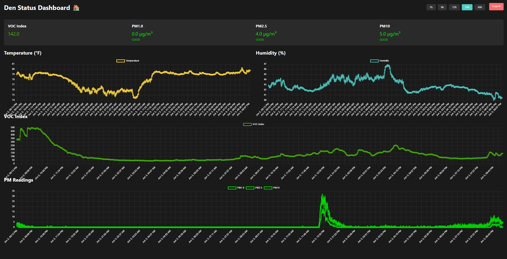

# Den Dashboard

A real-time environmental monitoring system combining ESP32-based sensors with a web dashboard for tracking air quality and environmental conditions. The system collects data from strategically placed sensors and displays particulate matter (PM1.0, PM2.5, PM10), VOC index, temperature, and humidity readings in an intuitive interface.


## Screenshot



*The dashboard showing real-time environmental data with historical trends*

## Technical Stack

- Hardware: ESP32 microcontroller with environmental sensors
- Frontend: React with Chart.js for data visualization
- Backend: Cloudflare Workers
- Database: Azure Cosmos DB
- Authentication: JWT-based system
- Communication: HTTP/HTTPS for sensor data transmission

## Hardware Integration

The dashboard receives data from an ESP32 microcontroller equipped with environmental sensors. The system includes:

- ESP32 microcontroller for data collection and transmission
- Temperature and humidity sensor (SHT31)
- Air quality sensors for PM1.0, PM2.5, and PM10 measurements (PMS7003M)
- VOC sensor for air quality index (SGP40)
- Custom-designed magnetic enclosure for easy mounting and maintenance

The ESP32 periodically sends sensor readings to the dashboard, which are then stored in the database and displayed in real-time.

## Setup

### Prerequisites

- Node.js (v16 or higher)
- npm or yarn
- Cloudflare account
- Azure Cosmos DB account

### Environment Variables

Create a `.env` file in the root directory with the following variables:

```
REACT_APP_API_URL=your_cloudflare_worker_url
```

For the Cloudflare Worker, set these environment variables in the Cloudflare dashboard:

```
COSMOS_ENDPOINT=your_cosmos_endpoint
COSMOS_KEY=your_cosmos_key
JWT_SECRET=your_jwt_secret
ADMIN_PASSWORD=your_admin_password
```

### Installation

1. Clone the repository
2. Install dependencies:
   ```bash
   cd dashboard-frontend
   npm install
   ```
3. Build the frontend:
   ```bash
   npm run build
   ```
4. Deploy the Worker:
   ```bash
   wrangler deploy
   ```

## Development

To run the frontend in development mode:

```bash
cd dashboard-frontend
npm start
```

## Security

The dashboard implements JWT-based authentication with a one-year token expiration. All API endpoints are protected and require valid authentication.

## Data Standards

The dashboard follows EPA air quality standards for particulate matter:

- PM1.0: 0-10 μg/m³ (Good), 11-25 μg/m³ (Moderate), 26-50 μg/m³ (High), >50 μg/m³ (Very High)
- PM2.5: 0-9 μg/m³ (Good), 10-35.4 μg/m³ (Moderate), 35.5-55.4 μg/m³ (Unhealthy for Sensitive Groups), 55.5-125.4 μg/m³ (Unhealthy), 125.5-225.4 μg/m³ (Very Unhealthy), >225.4 μg/m³ (Hazardous)
- PM10: 0-54 μg/m³ (Good), 55-154 μg/m³ (Moderate), 155-254 μg/m³ (Unhealthy for Sensitive Groups), 255-354 μg/m³ (Unhealthy), 355-424 μg/m³ (Very Unhealthy), >424 μg/m³ (Hazardous)

## License

MIT License 